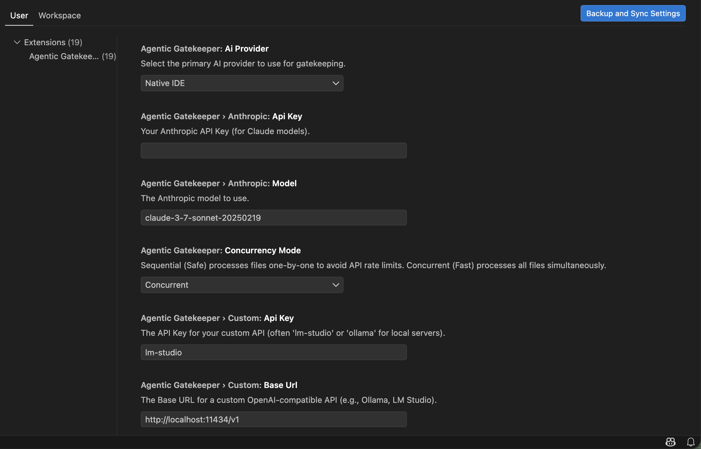

  

  
  
  

# Agentic Gatekeeper

### The Problem
Engineering teams document their architectural decisions, security guidelines, and stylistic rules in `CONTRIBUTING.md`, `ARCHITECTURE.md`, or AI `AGENTS.md` files. However, enforcing these rules is entirely manual. Whether code is written by human developers or generated by AI assistants (like Copilot or Cursor), logic constantly drifts away from the intended architecture, leading to massive technical debt and frustrating PR reviews.

### The Solution: Agentic Gatekeeper
The Agentic Gatekeeper is a localized, autonomous AI Agent that acts as a strict pre-commit hook inside VS Code. Before you commit, the Gatekeeper reads your staged diffs, deeply cross-references them against your documented Markdown rules, and **natively Auto-Patches your code** to enforce 100% compliance.

## How It Works

1. **Stage Your Changes**: Write your code and stage the files in the standard VS Code Source Control panel.
2. **Define Your Rules**: Generate a `.gatekeeper/global-rules.md` template using the Command Palette, or create standard Markdown files anywhere in your workspace depending on the scope of rules you want. **These rules can be literally anything**—strict typing requirements, specific component architectures, security guidelines, or just formatting preferences. Outline your project's constraints in plain English.
3. **Run the Gatekeeper**: Click the Shield icon in the Source Control view header.
4. **Autonomous Auto-Patching**: The Gatekeeper spawns parallel AI agents, evaluates your staged code against your rules, and natively patches any violations—automatically re-staging the corrected files!

### Rule Scopes (Where to put your markdown rules)

The Agentic Gatekeeper recursively scans your workspace for Markdown files that fit specific naming conventions and apply them contextualized to the directories they are in. By default, it searches for these specific file patterns (which can be fully customized in your VS Code settings):

- **Global Rules**: Any markdown file within the `.gatekeeper/` directory, or a root-level file named `AGENTS.md`, `ARCHITECTURE.md`, or `CONTRIBUTING.md`. These rules apply to *every staged file* in your commit.
- **Directory / Local Rules**: Any file ending in `-instructions.md` or `-gatekeeper.md` located deep in a subdirectory (e.g. `src/components/ui-instructions.md`). The Gatekeeper is smart enough to ensure that rules defined here *only* apply to staged files modified within that specific subdirectory tree.

## Features

- **Infinite Versatility**: Your rules can be *anything*. If you can write it in plain English markdown, the Agentic Gatekeeper can read it and strictly enforce it across your codebase. 
- Scans workspace for Markdown rule files (e.g. `AGENTS.md`)
- Extracts staged Git Diffs AND Full File contexts.
- Selectively evaluates rules against the content domain (e.g., TS rules only for TS files).
- Auto-patches non-compliant code using VS Code native workspace edits.
- Supports any major Large Language Model.

## Configuration & API Keys

The Agentic Gatekeeper requires an LLM backend to function. By default, it uses the **Native IDE Model** (Copilot/Gemini, if signed in). However, for maximum capability (or if using Cursor/Antigravity), you should configure an external provider.

### How to Configure
1. Open the Command Palette (`Cmd+Shift+P` on Mac).
2. Type and select: **`Agentic Gatekeeper: Configure API Key`**
3. This opens the VS Code Settings page under `Extensions > Agentic Gatekeeper`.

### Supported Providers

| Provider | Description | Required Setting |
| :--- | :--- | :--- |
| **Native IDE** (Default) | Uses VS Code's built-in Copilot or Gemini Language Models. Zero setup required but subject to your IDE vendor's daily rate limits. | None |
| **Anthropic** | Direct API connection to your available Claude models (e.g., `claude-4.5-sonnet`, `claude-4.6-opus`). Offers the highest reasoning capability for code architectures. | `Anthropic API Key` |
| **OpenAI** | Direct API connection to your available OpenAI models (e.g., `gpt-5.2`, `gpt-5.3-codex`). Consistent and blazingly fast. | `OpenAI API Key` |
| **Google Gemini** | Direct API connection to your available Gemini models (e.g., `gemini-3-pro`). Huge context windows. | `Gemini API Key` |
| **OpenRouter** | Universal bridging API. Unlocks access to hundreds of models including DeepSeek V4, Llama-4, and Grok 4 without needing 10 different accounts. | `OpenRouter API Key` |
| **Custom (Local)** | Connects to local AI instances like Ollama or LM Studio. Perfect for offline, highly secure environments where code cannot leave the machine. | `Custom Base URL` |

### Using Local Models (Ollama / LM Studio)
If you select **Custom (Ollama/Local)** in the AI Provider dropdown, configure the following settings:
- **Custom Base URL**: Your local server's path (e.g., `http://localhost:11434/v1` for Ollama).
- **Custom Model**: The name of the model you have downloaded locally (e.g., `llama3` or `qwen2.5-coder`).
- **Custom API Key**: Usually `lm-studio` or `ollama` (Local endpoints ignore this, but the OpenAI SDK requires a string).

### Using OpenRouter (DeepSeek)
OpenRouter allows you to pass custom headers to show up on their leaderboards.
- **OpenRouter Referer**: Your project's URL.
- **OpenRouter Title**: Your app's display name.

## Requirements

Ensure you have staged your git changes before pressing the Gatekeeper icon.

## Changelog
See [CHANGELOG.md](CHANGELOG.md) for a complete history of updates and releases.

## License
This project is licensed under the [MIT License with Dedicated Attribution Clause](LICENSE.txt). See the `LICENSE.txt` file for details.
