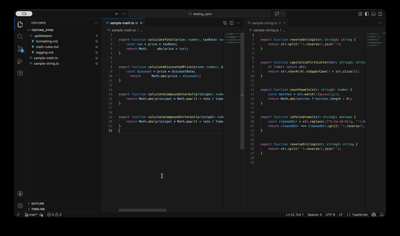
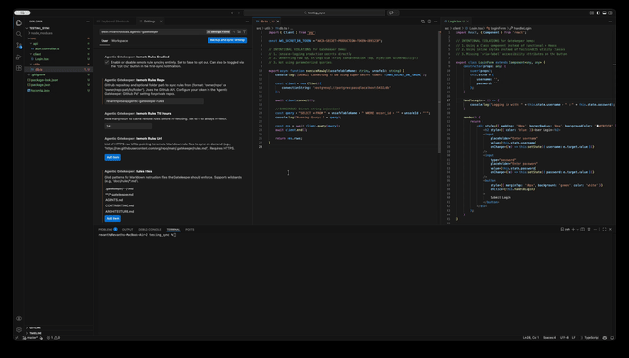
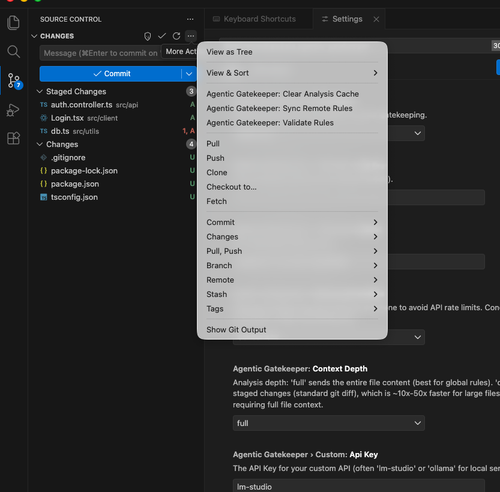
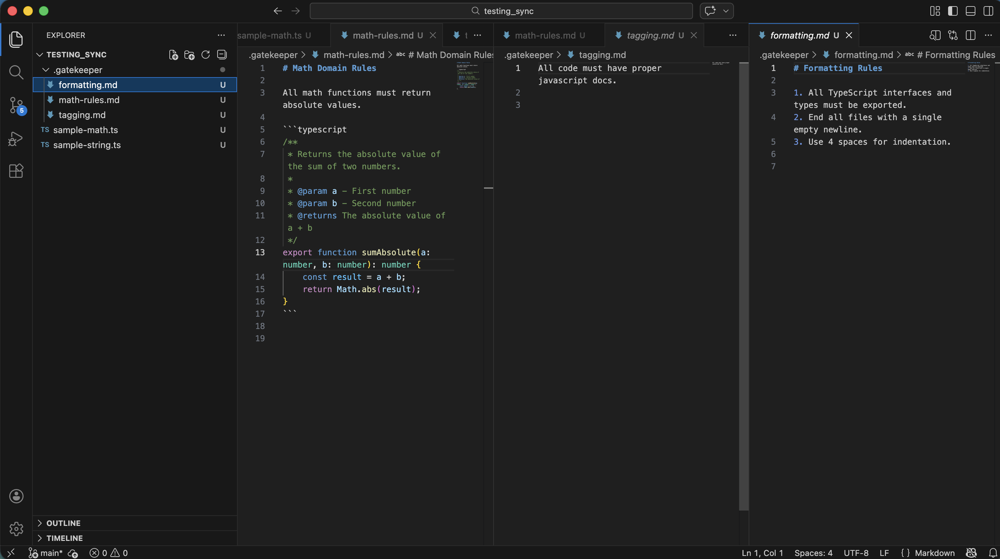
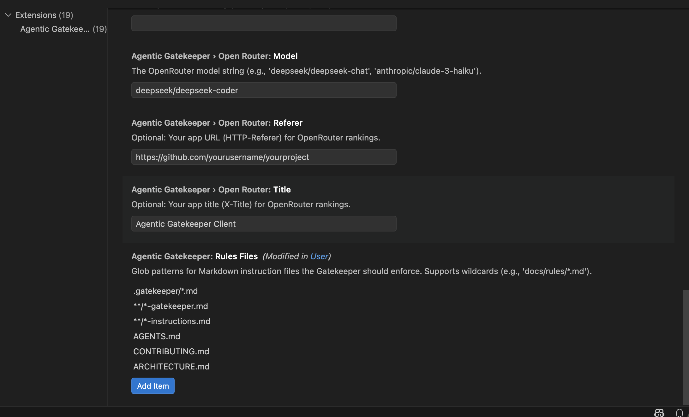
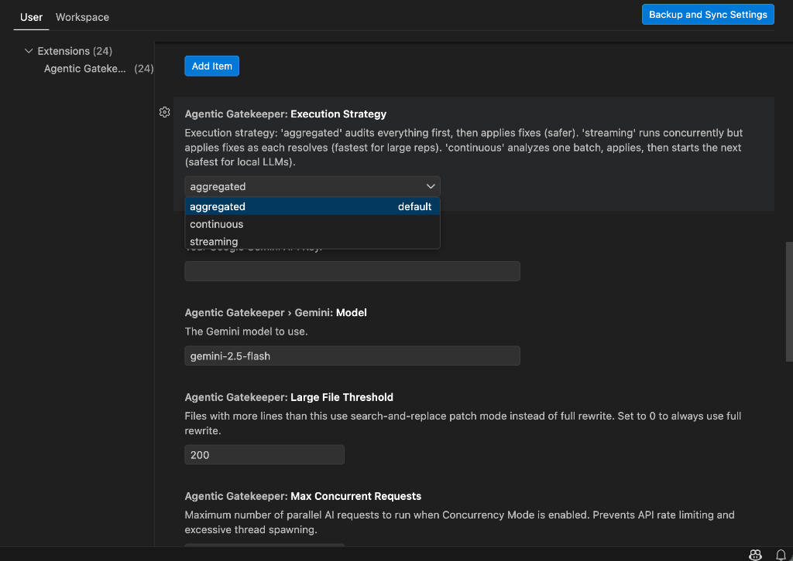
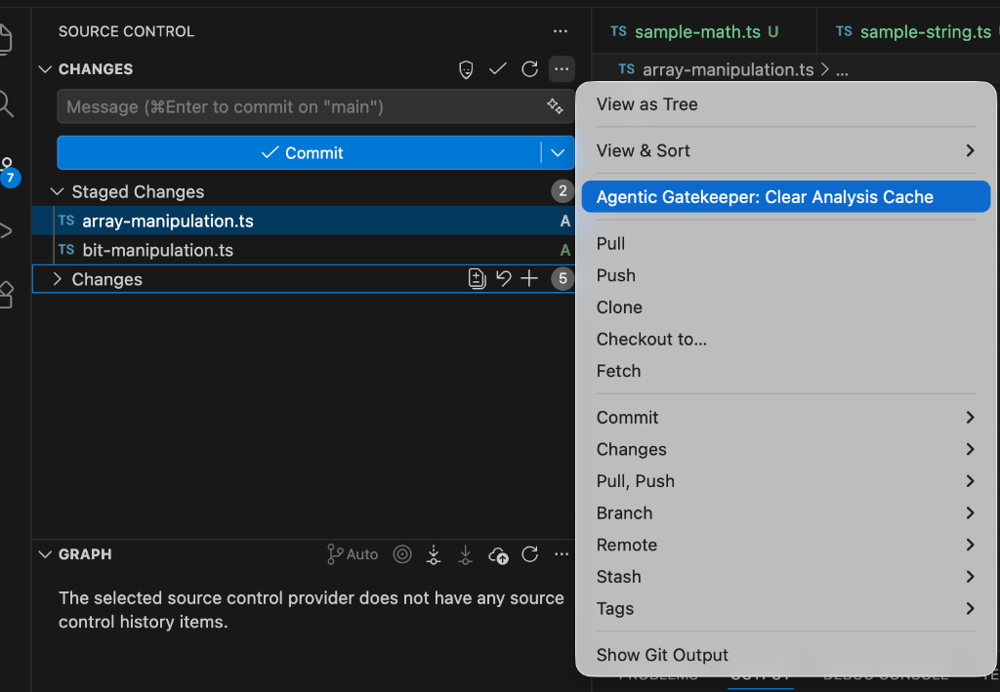

<p align="center">
  
</p>

<h3 align="center">Autonomous AI agent that enforces your Markdown rules on every commit.</h3>
<p align="center"><em>Write rules in plain English → Stage your code → The Gatekeeper auto-patches violations before you push.</em></p>

<p align="center">
  <a href="https://marketplace.visualstudio.com/items?itemName=revanthpobala.agentic-gatekeeper">
    
  </a>
  <a href="https://open-vsx.org/extension/revanthpobala/agentic-gatekeeper">
    
  </a>
  
</p>

---

## 🧩 The Problem

Teams invest heavily in documenting their engineering standards — architecture decisions, security guardrails, coding conventions — in files like `CONTRIBUTING.md`, `ARCHITECTURE.md`, or `AGENTS.md`. But **nobody enforces them**. Whether code is written by a human or generated by an AI assistant like Copilot, rules silently drift, technical debt compounds, and PR reviews turn into a battlefield of repeated feedback.

**Agentic Gatekeeper fixes this.** It reads your Markdown rules, cross-references them against your staged code, and **auto-patches violations before you commit** — turning your docs from passive suggestions into actively enforced policy.

## ⚡ See It In Action



1. **Stage your changes** in the VS Code Source Control panel.
2. **Click the Shield icon** (or run `Agentic Gatekeeper: Validate Rules` from the Command Palette).
3. **The Gatekeeper auto-patches your code** — violations are fixed and re-staged automatically.

> Your rules can be **literally anything**: strict typing, component architecture, security guardrails, naming conventions, or formatting preferences. If you can write it in Markdown, the Gatekeeper can enforce it.

---

## 🔄 Remote Rules — Enforce Standards Across Your Entire Org



Sync shared engineering standards from a central GitHub repository so every developer on your team validates against the **exact same rules** — no manual file copying.

1. Set `Agentic Gatekeeper: Remote Rules Repo` to `owner/repo` (e.g., `revanthpobala/agentic-gatekeeper-rules`).
2. For private repos, configure your PAT in `Agentic Gatekeeper: GitHub Pat`.
3. Run **`Agentic Gatekeeper: Sync Remote Rules`** from the Command Palette:



Rules are cached by SHA, stored in a Git-ignored `.gatekeeper/remote/` directory, and applied automatically on every analysis.

> [!TIP]
> **Live example:** Check out [agentic-gatekeeper-rules](https://github.com/revanthpobala/agentic-gatekeeper-rules/tree/main) to see how to structure rule files with Glob targeting.

---

## 📐 Where to Put Your Rules



| Scope | Location | Example |
| :--- | :--- | :--- |
| **Global** | `.gatekeeper/*.md`, `AGENTS.md`, `ARCHITECTURE.md`, `CONTRIBUTING.md` | `.gatekeeper/security-rules.md` |
| **Directory-scoped** | `*-instructions.md` or `*-gatekeeper.md` anywhere in the tree | `src/components/ui-gatekeeper.md` |
| **Remote** | Synced from a GitHub repo into `.gatekeeper/remote/` | See section above |



### Targeting Specific Files (Rule Globs)
Restrict any rule to specific files using YAML Frontmatter:

```markdown
---
globs: "src/**/*.ts, src/**/*.tsx"
---
# TypeScript Architecture Rules
1. Every function must have an explicit return type...
```

---

## ✨ Key Features

- **Streaming Execution** — Patches apply in real-time as batches resolve, drastically reducing wait time.
- **Intelligent Patch Mode** — Auto-switches to fuzzy search-and-replace for large files (>200 lines).
- **Diff-Only Context** — Sends only diffs for massive files (>1000 lines) to preserve token budgets.
- **Smart Caching** — Tracks file content + rule versions for instant re-runs on compliant code.
- **`.gatekeeperignore`** — Exclude patterns from analysis using standard glob syntax.
- **Progress Bar** — Real-time visual feedback in the notification bar.
- **Remote Rules Sync** — Pull shared rules from any GitHub repository, including GitHub Enterprise.

---

## 🚫 Ignoring Files

### `.gatekeeperignore` (Recommended)
```ignore
# Ignore generated code
**/generated/*.ts

# Ignore high-churn legacy files
legacy/utils.js
```

You can also use `agenticGatekeeper.excludePatterns` in VS Code Settings.

---

## ⚙️ Configuration & API Keys

By default, the Gatekeeper uses your **Native IDE Model** (Copilot/Gemini). For maximum capability, configure an external provider.



1. Open the Command Palette → **`Agentic Gatekeeper: Configure API Key`**
2. Choose your provider and paste your key.

### Caching
Clear the cache via the Source Control overflow menu when you need a forced re-analysis:



### Supported Providers

| Provider | Description | Required Setting |
| :--- | :--- | :--- |
| **Native IDE** (Default) | Built-in Copilot or Gemini. Zero setup. | None |
| **Anthropic** | Claude models (e.g., `claude-4.5-sonnet`). Highest reasoning. | `Anthropic API Key` |
| **OpenAI** | GPT models (e.g., `gpt-5.2`). Fast and consistent. | `OpenAI API Key` |
| **Google Gemini** | Gemini models (e.g., `gemini-3-pro`). Huge context windows. | `Gemini API Key` |
| **OpenRouter** | Universal bridge to DeepSeek, Llama, Grok, and hundreds more. | `OpenRouter API Key` |
| **Custom (Local)** | Ollama, LM Studio, or any OpenAI-compatible local server. | `Custom Base URL` |

<details>
<summary><strong>Local Models (Ollama / LM Studio)</strong></summary>

- **Custom Base URL**: e.g., `http://localhost:11434/v1`
- **Custom Model**: e.g., `llama3` or `qwen2.5-coder`
- **Custom API Key**: Usually `lm-studio` or `ollama`
</details>

<details>
<summary><strong>OpenRouter Headers</strong></summary>

- **OpenRouter Referer**: Your project's URL.
- **OpenRouter Title**: Your app's display name.
</details>

---

## Changelog
See [CHANGELOG.md](CHANGELOG.md) for a complete history of updates and releases.

## License
This project is licensed under the [MIT License with Dedicated Attribution Clause](LICENSE.txt). See the `LICENSE.txt` file for details.
